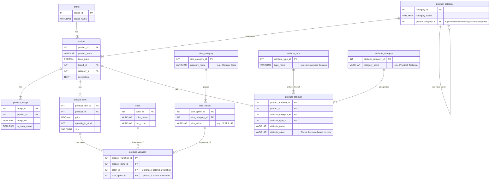

# E-commerce Database Design

## 🎯 Objective

This project is a peer group assignment focused on designing and implementing an e-commerce database from scratch. The objective is to master database design principles by creating an Entity-Relationship Diagram (ERD) and the corresponding SQL code to build the database structure.

## 🛠️ Instructions

The project involved the following steps:

1. **ERD Creation:** Designing the database structure, defining entities (tables), attributes, relationships, primary keys, foreign keys, and constraints. This was visualized using an ERD tool (or Mermaid code).

2. **Data Flow Planning:** Mapping out how data flows between entities and planning the database structure and implementation collaboratively.

3. **Group Collaboration:** Working together on all phases of the project, ensuring shared understanding and effective teamwork.

4. **Database Implementation:** Writing the SQL code to create the database and all specified tables.

5. **Testing:** Creating and running SQL scripts to test the database structure and data insertion.

## 🗃️ Database Structure

The database is named `ecomercedb` and includes the following tables:

* `brand`

* `product_category`

* `product`

* `product_image`

* `product_item`

* `color`

* `size_category`

* `size_option`

* `product_variation`

* `attribute_type`

* `attribute_category`

* `product_attribute`

## 📊 Entity-Relationship Diagram (ERD)

The database structure is visualized in the Entity-Relationship Diagram. The ERD shows the entities, their attributes, and the relationships between them.

*(You can either include an image of your ERD here or include the Mermaid code directly if your platform supports rendering it.)*


*(Replace the above Mermaid code block with an image reference if you prefer)*

## 🚀 Setup and Usage

1. **Clone the repository:**

   ```bash
   git clone <repository_url>

   ```

2. **Navigate to the repository directory:**

   ```bash
   cd <repository_name>

   ```

3. **Create the database:** Use a SQL client (like MySQL Workbench, pgAdmin, or the command line) to execute the `ecommerce.sql` file. This script will create the `ecomercedb` database and all necessary tables.

   ```bash
   mysql -u your_username -p < ecommerce.sql
   # Or for PostgreSQL:
   # psql -U your_username -d your_database -f ecommerce.sql

   ```

   *(Adjust the command based on your specific database system)*

4. **Run the test script:** Execute the `ecommerce_sql_test.sql` script to insert sample data and run test queries.

   ```bash
   mysql -u your_username -p ecomercedb < ecommerce_sql_test.sql
   # Or for PostgreSQL:
   # psql -U your_username -d ecomercedb -f ecommerce_sql_test.sql

   ```

## 🧪 Testing

The `ecommerce_sql_test.sql` file contains SQL commands to:

* Insert sample data into all tables.

* Execute various `SELECT` queries to verify data integrity and relationships between tables.

Running this script will help confirm that the database structure is correctly implemented and can store and retrieve data as expected.

## 🧑‍🤝‍🧑 Group Collaboration

This project was developed collaboratively using GitHub for version control. Key aspects of our collaboration included:

* Regular meetings to discuss design decisions and progress.

* Using GitHub for code sharing, version tracking, and issue management.

* Mutual review and understanding of all parts of the project.

## 📂 Submission

The final ERD and the `ecommerce.sql` file are available in this public GitHub repository, ensuring accessibility for review.
